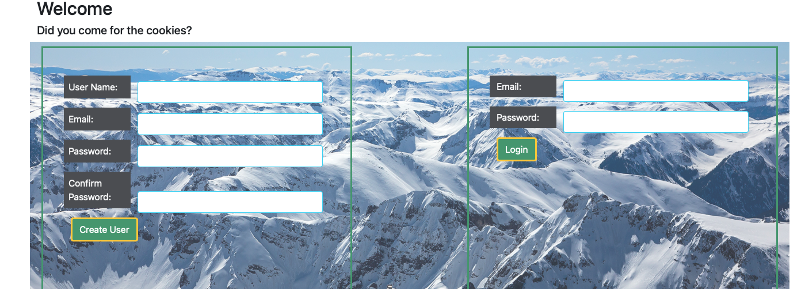
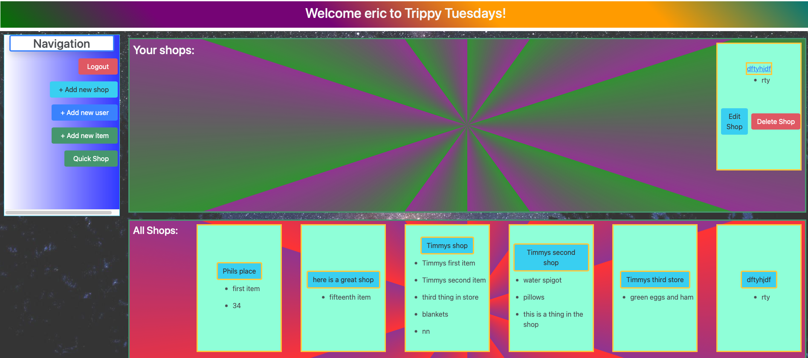
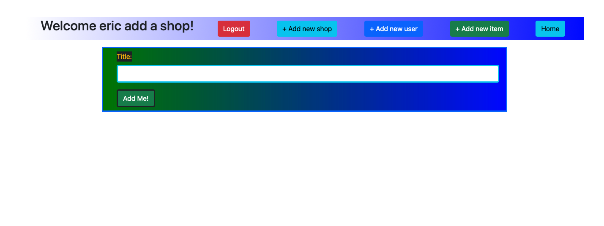
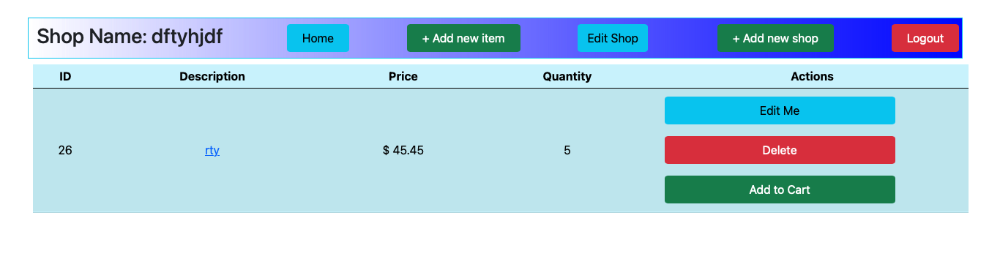
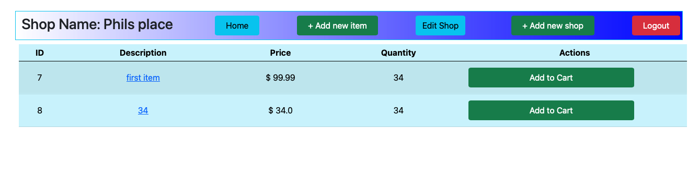
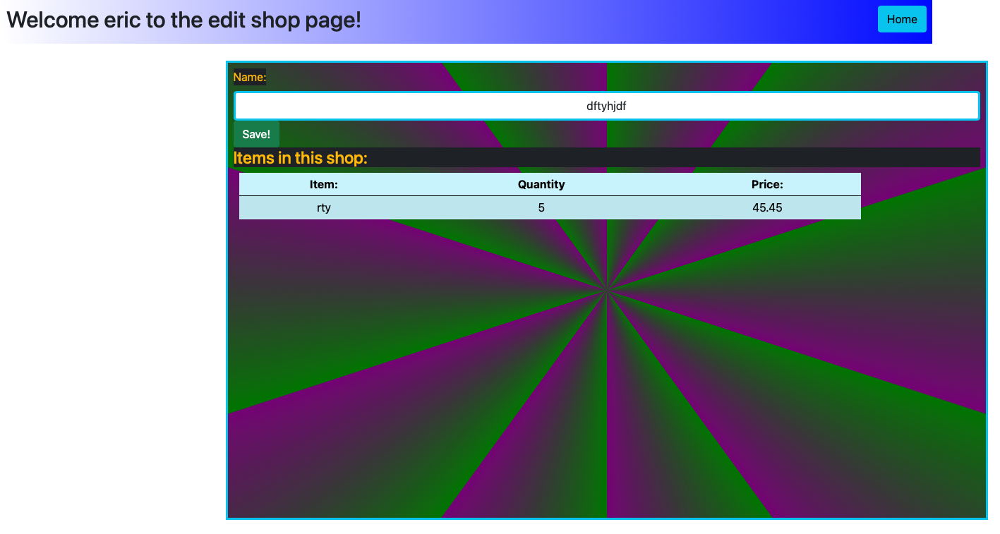
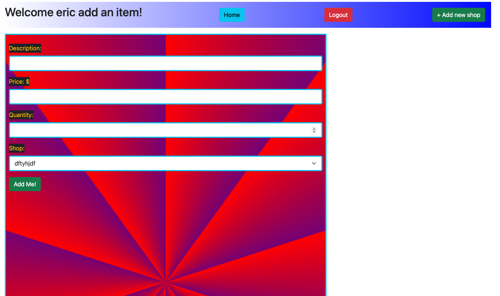
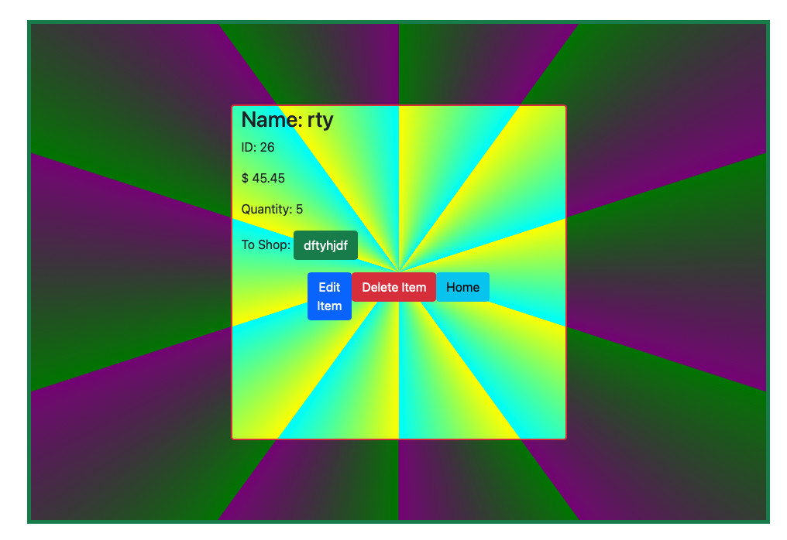
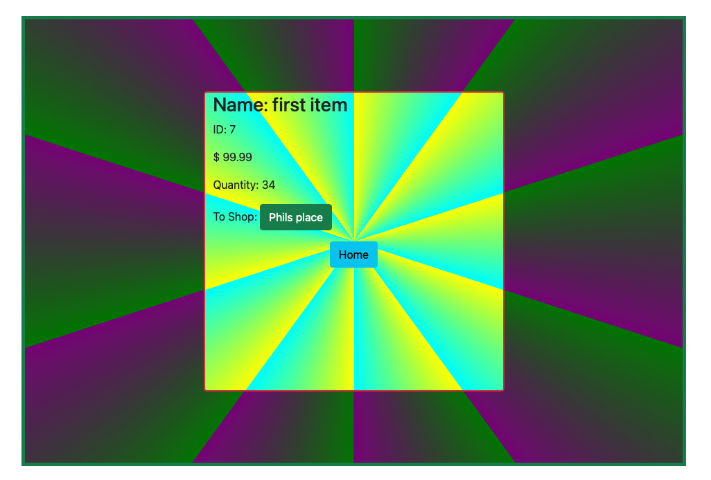
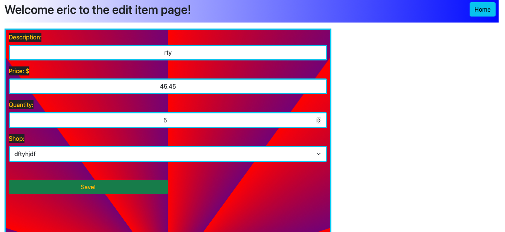

# soloproject
Full Stack web application written in Java and SpringBoot. Tech used in this application includes; JPA, JSP rendering, Hibernate Persistence, MySQL database, Bootstrap 5, jQuery, Figma (wireframe), Maven, Spring MVC, full CRUD functionality, conditional rendering.  

Registration / Login:

Home:

Create Shop:

View Shop:

Non Creator Shop View:

Edit Shop:

Create Item:

View Item: 

Non Creator Item View:

Edit Item:

